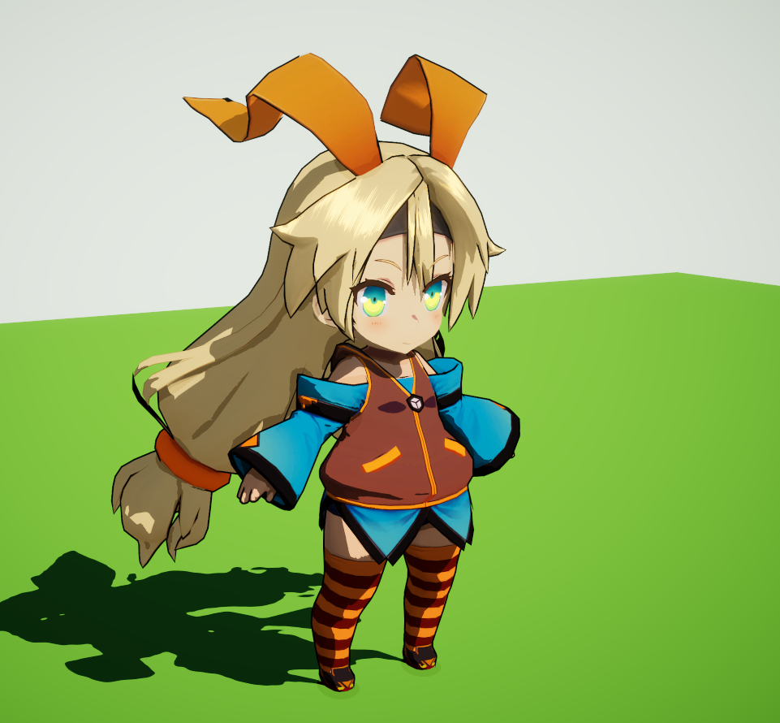

# URP Toon Shader
- [Introduction](#Introduction)
- [Properties](#Properties)
	- [SurfaceOptions](#SurfaceOptions)
	- [Base](#Base)
	- [Shadow](#Shadow)
	- [Specular](#Specular)
	- [Rim](#Rim)
	- [Outline](#Outline)
	- [AdvancedOptions](#AdvancedOptions)
- [Multi Pass Shader with SPR Batch](#Multi Pass Shader with SPR Batch)
- [Reference](#Reference)
- [Licenses](#Licenses)

## Introduction
基于URP的通用卡通着色器，使用URP标准的PBR模型（Minimalist CookTorrance BRDF）进行改造，纯代码实现，没有使用ShaderGraph,兼容SPR Batch.  
Universal Toon shader based on URP , use PBR lighting（Minimalist CookTorrance BRDF） in URP,use code without ShaderGraph,SPR Batch Compatible.  
- Unity 2019.3.15+、URP 7.4.1+  

## Properties
### SurfaceOptions

- Workflow Mode : Specular or Metallic 
- SurfaceType : Opaque or Transparent 
- Render Face : Front Back Both (For Forward Pass)
- Alpha Clipping : ClipMask(裁剪遮罩)，Threshold(阈值)
- Stencil : 模板测试，用于实现眼睛的遮挡效果，参考UTS(Stencil Test,used to achieve transparent effects for toon eyes,reference from UTS)  
- Stencil Type : 
Mask-写入缓冲的物体,渲染队列要比Out优先(Things that want to write to the buffer,Render Queue Less than "Out"):  
Stencil {  
                Ref[_StencilChannel]  
                Comp Always  
                Pass Replace  
                Fail Replace  
            }  
Out-从缓冲读取的物体(Read from the buffer)  
Stencil {  
                Ref[_StencilChannel]  
                Comp NotEqual  
                Pass Keep  
                Fail Keep  
            }  
Stencil Channel : 1-255

### Base

### Shadow

- UseRampMapShadow : 使用RampMap控制阴影衰减。
- VOffset : RampMap采样的V坐标
- Shadow1Color ：第一层阴影颜色
- Shadow2Color ：第二层阴影颜色
- Shadow1Step : 第一层阴影阈值
- Shadow1Feather : 第一层阴影羽化值
- Shadow2Step : 第二层阴影阈值
- Shadow2Feather : 第二层阴影羽化值
- EnableInShadowMap : 固定阴影贴图
- Receive Shadow : 接收阴影（ShadowCoord）

### Specular

- Specular
- SpecularStep : 高光阈值
- SpecularFeather : 高光羽化
- Smoothness : 光滑度
- HairSpecular : 各向异性头发高光
- HairShiftMap : 切线偏移图、偏移强度
- SpecularShift : 第一层高光偏移量
- SpecularShiftSec : 第二层高光偏移量
- SpecularSecMul : 第二层高光强度（*Specular)
- EnablesSpecularHighlights : 是否使用高光

### Rim

- EnbleRim ：启用边缘光
- BlendRim : 颜色插值
- RimColor
- RimPower : 强度
- RimStep
- RimFeather

### Outline

- EnableOutline ：启用描边
- UseSmoothNormal : 使用平滑法线(ModelOutlineImporter:https://github.com/Jason-Ma-233/JasonMaToonRenderPipeline#%E5%B9%B3%E6%BB%91%E6%B3%95%E7%BA%BF%E5%AF%BC%E5%85%A5%E5%B7%A5%E5%85%B7ModelOutlineImporter)
- OutlineColor
- OutlineWidth

### AdvancedOptions

- Environment Reflections : 是否接收反射  
- Enable GPU Instancing : 使用GPU Instancing合批  
- RenderQueue : 渲染队列  

## Multi Pass Shader with SPR Batch 

In the default URP, if render multiple pass shaders, the Rendering order like this: 
Object1.Pass1-
Objcet1.Pass2-
Object2.Pass1-
Object2.Pass2......

This will stop SPRBatch.

Use ComstomRenderer,the Rendering order like this:
Object1.Pass1-
Objcet2.Pass1-
Object1.Pass2-
Object2.Pass2......

How to Set project:

1.Create CustomForwardRenderer Asset.
Assets/Create/Rendering/Universal Render Pipeline/ToonForward Renderer

2.Setup Pipeline Asset

Node1 : Use Assembly Definition Reference to access urp package.
Node2 : SRP Batch does not support Skin Mesh yet.

## Reference

https://github.com/unity3d-jp/UnityChanToonShaderVer2_Project  
https://github.com/Jason-Ma-233/JasonMaToonRenderPipeline  
https://github.com/you-ri/LiliumToonGraph  
https://github.com/Kink3d/kShading  
https://unity.cn/projects/china-unity-tech-week_linruofeng

## Licenses

MIT

"Assets/UnityChan/License"

© Unity Technologies Japan/UCL
