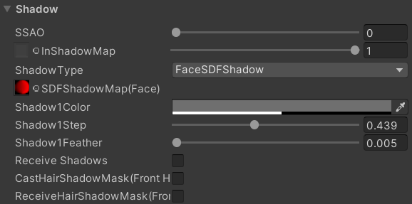
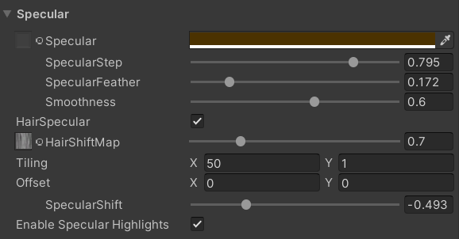

# URP Toon Shader
- [Introduction](#Introduction)
- [Properties](#Properties)
	- [SurfaceOptions](#SurfaceOptions)
	- [Base](#Base)
	- [Shadow](#Shadow)
	- [Specular](#Specular)
	- [Rim](#Rim)
	- [Outline](#Outline)
	- [AdvancedOptions](#AdvancedOptions)
- [Multi Pass Batch](#Multi-Pass-Batch)
- [Reference](#Reference)
- [Licenses](#Licenses)

## Introduction  
Simple toon shader in unity universal pipeline.

  

Genshin Impact Style(Model and Texture from miHoYo)

  

## Properties
### SurfaceOptions
 

### Base
 
### Shadow
 

#### ShadowType

##### DoubleShade 
Adjustable two-layer shadow.(Reference UTS)

##### RampMapShadow 
Shadows based on rampmap.

##### SDF_FaceShadow (Reference Genshin Impact) 

Used for face shadow, sample a precomputed shadow mask to generate shadows.
Limit:symmetrical face uv.

 

Need to add a script to the object, set the forward and left direction(ObjectSpace).

 

About how to generate sdf shadow mask.
Node:Generate mask in r16 format(antialiasing).

https://zhuanlan.zhihu.com/p/389668800 

#### SSAO (Add "ScreenSpaceAmbientOcclusion" RenderFeature)

Control SSAO strength.

#### CastHairShadowMask (Add "RenderFrontHairShadowMaskFeature" RenderFeature)

Cast a shadow mask in screen space for face shadow.(Check it on front hair material or something)

#### ReceiveHairShadowMask

Sample "CastHairShadowMask" for shadow.(Check it on face material)

### Specular

 

### Rim
  

- RimBlendShadow  

 

1:RimBlendShadow=0 2:RimBlendShadow=1 3:RimBlendShadow=1 RimFlip=1  

- RimFlip  

Flip RimBlendShadow

### Outline
  
- UseSmoothNormal : (if use this feature, you need to check "Read/Write Enbale" in the Import Setting of the model, and then rename the model to "XXX_ol":https://github.com/Jason-Ma-233/JasonMaToonRenderPipeline#%E5%B9%B3%E6%BB%91%E6%B3%95%E7%BA%BF%E5%AF%BC%E5%85%A5%E5%B7%A5%E5%85%B7ModelOutlineImporter)

### AdvancedOptions
 

## Multi Pass Batch

In the default URP, if render multiple pass shaders(outline), the Rendering order like this:  
Object1.Pass1-  
Objcet1.Pass2-  
Object2.Pass1-  
Object2.Pass2......  
    
It will stop SPRBatch.  
   
We can change the Rendering order like this by using RenderFeature:  
Object1.Pass1-  
Objcet2.Pass1-  
Object1.Pass2-  
Object2.Pass2......  
   

## Reference

https://github.com/unity3d-jp/UnityChanToonShaderVer2_Project  
https://github.com/Jason-Ma-233/JasonMaToonRenderPipeline  
https://github.com/you-ri/LiliumToonGraph  
https://github.com/Kink3d/kShading  
https://unity.cn/projects/china-unity-tech-week_linruofeng

## Licenses

MIT

"Assets/UnityChan/License"

© Unity Technologies Japan/UCL
